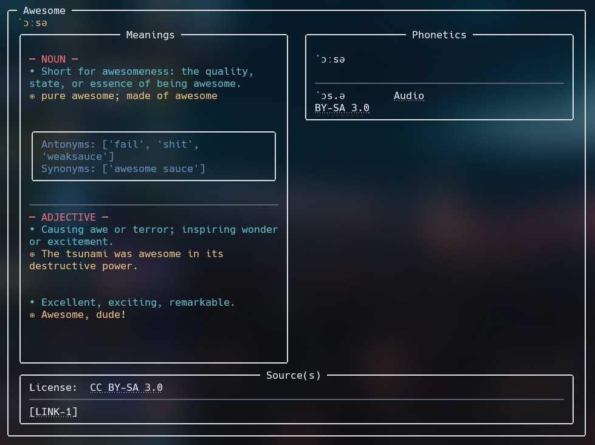

# Define
A CLI that helps you with defination of the world

## Screenshot

Suported languages:
- English

## Requirements
- Python
- pip
- less (text paper)

## Build
Clone the project into your directory

```shell
git clone "https://github.com/empitrix/define_word"
cd define_word .
# install Python requirements libraries
pip install -r ./requirements.txt
# to run the project
python ./main.py
```

## How To Run
For this project, you need to set `alias` for `main.py`.  The reason why there is no executable file for different platforms is that Python is actually super slow to use in a CLI, and the project is just an educational test for me.

## Acknowledgement
- [**Free Dictionary API**](https://github.com/meetDeveloper/freeDictionaryAPI): The main API of the CLI
- [**Rich**](https://github.com/Textualize/rich): Rich is a Python library for rich text and beautiful formatting in the terminal.
